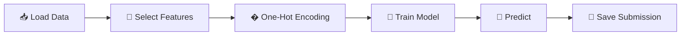

<div align="center">

# 🚢 Titanic Survival Prediction


[](https://www.python.org/)
[](https://scikit-learn.org/)
[](https://pandas.pydata.org/)
[](LICENSE)

**Machine Learning solution for predicting Titanic passenger survival**

[Features](#-features) •
[Quick Start](#-quick-start) •
[Methodology](#-methodology) •
[Project Structure](#-project-structure)

</div>

---

## 📊 Overview

This project uses machine learning to predict the survival of passengers aboard the RMS Titanic. The model analyzes data from 891 training passengers and makes predictions for 418 test passengers using a **Logistic Regression** classifier.

### 🎯 Objective
Predict whether a passenger survived or not based on their characteristics to submit to Kaggle's Titanic competition.

---

## ✨ Features

- 🤖 **Logistic Regression** classifier with max_iter=1000
- � Simple and effective feature selection (4 features only)
- 🔄 One-Hot Encoding for categorical variables
- 🎯 Direct training on full dataset (no train/validation split)
- 📁 Clean, organized code in Jupyter Notebook
- 💾 Automated submission file generation

---

## 🚀 Quick Start

### Prerequisites

Ensure you have Python 3.11+ and the following libraries installed:

```bash
pip install pandas numpy scikit-learn matplotlib seaborn
```

### Running the Project

1. **Clone the repository:**
   ```bash
   git clone https://github.com/NourSaudi/Titanic.git
   cd Titanic
   ```

2. **Launch Jupyter Notebook:**
   ```bash
   jupyter notebook Titanic.ipynb
   ```

3. **Execute cells in order:**
   - Import libraries
   - Load data
   - Prepare features
   - Train model
   - Generate predictions
   - Save submission file

---

## 🔬 Methodology

### 1️⃣ Data Loading

```python
df_train = pd.read_csv("train.csv")
df_test = pd.read_csv("test.csv")
```

- Training data: 891 passengers with survival labels
- Test data: 418 passengers (predictions needed)

### 2️⃣ Feature Selection & Engineering

```python
y_train = df_train['Survived']
features = ["Pclass", "Sex", "SibSp", "Parch"]
X_train = pd.get_dummies(df_train[features])
X_test = pd.get_dummies(df_test[features])

X_train = pd.get_dummies(X_train, drop_first=True)
X_test = pd.get_dummies(X_test, drop_first=True)
```

**Selected Features:**
- **Pclass** (1-3): Passenger class (1st, 2nd, 3rd)
- **Sex** (male/female): Passenger gender
- **SibSp** (0-8): Number of siblings/spouses aboard
- **Parch** (0-6): Number of parents/children aboard

**Note:** Age, Fare, Name, Ticket, Cabin, and Embarked were excluded to keep the model simple.

### 3️⃣ Model Training

```python
model = LogisticRegression(max_iter=1000)
model.fit(X_train, y_train)
```

- **Model:** Logistic Regression
- **Parameters:** max_iter=1000 (ensures convergence)
- **Training:** Trained on all 891 passengers (no validation split)

### 4️⃣ Prediction & Submission

```python
y_pred = model.predict(X_test)
output = pd.DataFrame({'PassengerId': df_test.PassengerId, 'Survived': y_pred})
output.to_csv('submission.csv', index=False)
```

---

## 📁 Project Structure

```
Titanic/
│
├── 📊 train.csv                 # Training data (891 passengers)
├── 📊 test.csv                  # Test data (418 passengers)
├── 📓 Titanic.ipynb            # Main Jupyter Notebook
├── 📄 submission.csv            # Final submission file
└── 📖 README.md                # This file
```

---

## 🛠️ Tech Stack

<div align="center">

| Technology | Purpose |
|---------|-----------|
| **Python 3.11** | Core programming language |
| **Pandas** | Data manipulation and analysis |
| **NumPy** | Numerical operations |
| **Scikit-Learn** | Logistic Regression model |
| **Matplotlib & Seaborn** | Data visualization |
| **Jupyter Notebook** | Interactive development |

</div>

---

## 📊 Data Pipeline



---

## 💡 Key Insights

1. **Gender is Key** 👩: Sex is the strongest predictor - women had much higher survival rates
2. **Class Matters** 🎫: First-class passengers had better chances of survival
3. **Family Size** 👨‍👩‍�: Number of family members aboard affects survival
4. **Simplicity Works** ⚡: A simple model with 4 features can be effective
5. **One-Hot Encoding** 🔢: Converts categorical variables (Sex) to numerical format

---

## 🎓 Future Improvements

- [ ] Add Age and Fare features (with proper missing value handling)
- [ ] Extract titles from names (Mr, Mrs, Miss, Master)
- [ ] Implement train/validation split for model evaluation
- [ ] Try advanced models (Random Forest, XGBoost)
- [ ] Perform hyperparameter tuning
- [ ] Add cross-validation for robust performance estimation
- [ ] Feature engineering (family size = SibSp + Parch)

---

## 📚 References

- [Kaggle Titanic Competition](https://www.kaggle.com/c/titanic)
- [Scikit-Learn Logistic Regression](https://scikit-learn.org/stable/modules/generated/sklearn.linear_model.LogisticRegression.html)
- [Pandas Documentation](https://pandas.pydata.org/docs/)

---

## 👤 Author

**Nour Saudi**

- 🌐 GitHub: [@NourSaudi](https://github.com/NourSaudi)
- 💼 LinkedIn: www.linkedin.com/in/nour-saudi-16008a2bb
- 📧 Email: noureldinsaudi1234123455@gmail.com

---

## 📄 License

This project is licensed under the MIT License - see the [LICENSE](LICENSE) file for details.

---

<div align="center">

### 🌟 If you found this project helpful, please give it a star! ⭐

**Made with ❤️ and ☕**

---

*"On that cold April night in 1912, the Titanic sank... but her data lives on to help us learn."* 🚢

</div>