<div align="center">

# 🚢 Titanic Survival Prediction


[](https://www.python.org/)
[](https://scikit-learn.org/)
[](https://pandas.pydata.org/)
[](LICENSE)

**Machine Learning solution for predicting Titanic passenger survival**

[Features](#-features) •
[Quick Start](#-quick-start) •
[Methodology](#-methodology) •
[Results](#-results) •
[Project Structure](#-project-structure)

</div>

---

## 📊 Overview

This project uses machine learning algorithms to predict the survival of passengers aboard the RMS Titanic. The model analyzes historical data from 891 passengers, utilizing features such as age, sex, passenger class, and number of siblings/spouses aboard.

### 🎯 Objective
Predict whether a passenger survived or not based on their personal characteristics, achieving the highest possible prediction accuracy.

---

## ✨ Features

- 🤖 Optimized **Logistic Regression** model for binary classification
- 📈 Comprehensive data preprocessing with intelligent missing value handling
- 🔄 Advanced feature engineering with One-Hot Encoding
- ⚖️ StandardScaler for data normalization and performance improvement
- 📊 Complete evaluation with Accuracy, Precision, Recall, and F1-Score
- 📁 Clean, organized code in Jupyter Notebook

---

## 🚀 Quick Start

### Prerequisites

Ensure you have Python 3.11+ and the following libraries installed:

```bash
pip install pandas numpy scikit-learn matplotlib seaborn
```

### Running the Project

1. **Clone the repository:**
   ```bash
   git clone https://github.com/your-username/titanic-prediction.git
   cd titanic-prediction
   ```

2. **Launch Jupyter Notebook:**
   ```bash
   jupyter notebook Titanic.ipynb
   ```

3. **Execute cells in order:**
   - Load data
   - Preprocess data
   - Train model
   - Generate predictions

---

## 🔬 Methodology

### 1️⃣ Exploratory Data Analysis

- Gender-based survival analysis (Women: **74%** survival rate, Men: **19%**)
- Missing value inspection and feature distribution
- Correlation analysis between features and survival rate

### 2️⃣ Data Preprocessing

```python
features = ['Pclass', 'Sex', 'Age', 'SibSp', 'Parch', 'Fare']

X_train = X_train.fillna(X_train.median(numeric_only=True))
X_train = pd.get_dummies(X_train, drop_first=True)

scaler = StandardScaler()
X_train_scaled = scaler.fit_transform(X_train)
```

### 3️⃣ Model Building

```python
model = LogisticRegression(max_iter=1000)
model.fit(X_train_scaled, y_train)
```

### 4️⃣ Evaluation

- Train/Validation Split: 80/20 ratio
- Metrics: Accuracy, Confusion Matrix, Precision, Recall, F1-Score

---

## 📈 Results

### Performance on Validation Data

| Metric | Value |
|--------|-------|
| **Accuracy** | **~80%** |
| **Precision** | **~79%** |
| **Recall** | **~72%** |
| **F1-Score** | **~75%** |

### Confusion Matrix

```
                Predicted
              Not Survived  Survived
Actually
Not Survived      90           15
Survived          21           53
```

### Most Influential Features

1. 👥 **Sex** - Strongest predictor of survival
2. 🎫 **Pclass** - First-class passengers had higher survival rates
3. 👶 **Age** - Children had better survival chances
4. 💰 **Fare** - Correlated with socioeconomic status

---

## 📁 Project Structure

```
Titanic/
│
├── 📊 train.csv                 # Training data (891 passengers)
├── 📊 test.csv                  # Test data (418 passengers)
├── 📓 Titanic.ipynb            # Main Jupyter Notebook
├── 📄 submission.csv            # Final submission file
├── 🐍 evaluation_code.py       # Standalone evaluation script
├── 📖 README.md                # This file
└── 📊 gender_submission.csv    # Sample submission
```

---

## 🛠️ Tech Stack

<div align="center">

| Technology | Purpose |
|---------|-----------|
| **Python 3.11** | Core programming language |
| **Pandas** | Data manipulation and analysis |
| **NumPy** | Mathematical operations |
| **Scikit-Learn** | ML model building and evaluation |
| **Matplotlib & Seaborn** | Data visualization |
| **Jupyter Notebook** | Interactive development environment |

</div>

---

## 📊 Data Pipeline

```mermaid
graph LR
    A[📥 Raw Data] --> B[🧹 Data Cleaning]
    B --> C[🔧 Feature Engineering]
    C --> D[⚖️ Scaling]
    D --> E[🤖 Model Training]
    E --> F[📊 Evaluation]
    F --> G[🎯 Predictions]
    G --> H[💾 Submission]
```



---

## 💡 Key Insights

1. **Women and Children First** 👩‍👧: Data confirms this policy was real
2. **Wealth Matters** 💎: First-class passengers had significantly higher survival rates
3. **Data Quality** 🔧: Proper handling of missing values improves accuracy
4. **Feature Alignment** ⚙️: Critical to synchronize columns between train and test sets

---

## 🎓 Future Improvements

- [ ] Experiment with advanced models (Random Forest, XGBoost, Neural Networks)
- [ ] Additional feature engineering (extract titles from names)
- [ ] Hyperparameter tuning using GridSearchCV
- [ ] Cross-validation for more robust evaluation
- [ ] Ensemble methods combining multiple models

---

## 📚 References

- [Kaggle Titanic Competition](https://www.kaggle.com/c/titanic)
- [Scikit-Learn Documentation](https://scikit-learn.org/stable/)
- [Pandas User Guide](https://pandas.pydata.org/docs/)

---

## 👤 Author

**Nour Saudi**

- 🌐 GitHub: [@NourSaudi](https://github.com/NourSaudi)
- 💼 LinkedIn: [Your LinkedIn](https://linkedin.com/in/yourusername)
- 📧 Email: your.email@example.com

---

## 📄 License

This project is licensed under the MIT License - see the [LICENSE](LICENSE) file for details.

---

<div align="center">

### 🌟 If you found this project helpful, please give it a star! ⭐

**Made with ❤️ and ☕**

---

*"On that cold April night in 1912, the Titanic sank... but her data lives on to help us learn."* 🚢

</div>